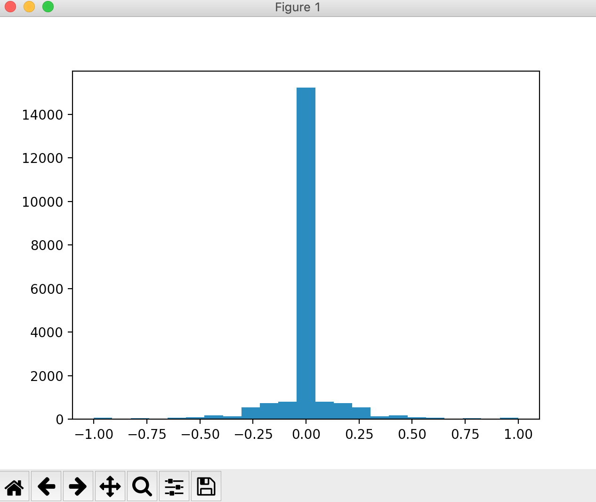
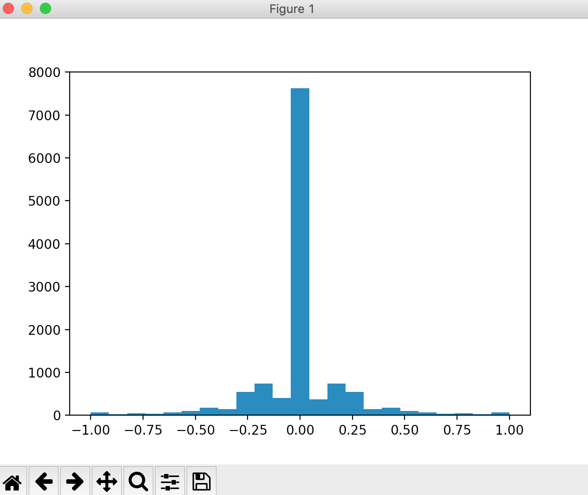
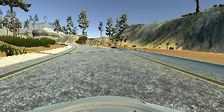
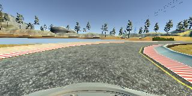
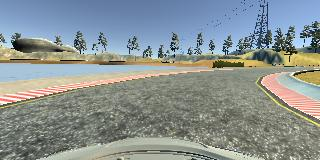

# **Behavioral Cloning** 


### I am using the writeup template provided by Udacity to explain my pipeline implementing project 4 of the Self-driving Car Engineer Nanodegree: Term 1.

---

##**Behavioral Cloning Project**

The goals / steps of this project are the following:

* Use the simulator to collect data of good driving behavior.
* Build a robust data preprocessing pipeline to support training.
* Build, a convolution neural network in Keras that predicts steering angles from images.
* Train and validate the model with a training and validation set.
* Test that the model successfully drives around track one without leaving the road.
* Summarize the results with a written report.


[//]: # (Image References)

[image1]: ./examples/placeholder.png "Model Visualization"
[image2]: ./examples/placeholder.png "Grayscaling"
[image3]: ./examples/placeholder_small.png "Recovery Image"
[image4]: ./examples/placeholder_small.png "Recovery Image"
[image5]: ./examples/placeholder_small.png "Recovery Image"
[image6]: ./examples/placeholder_small.png "Normal Image"
[image7]: ./examples/placeholder_small.png "Flipped Image"

### Rubric Points
Here I will consider the [rubric points](https://review.udacity.com/#!/rubrics/432/view) individually and describe how I addressed each point in my implementation.  

---
### Files Submitted & Code Quality

#### 1. Submission includes all required files and can be used to run the simulator in autonomous mode

My project includes the following files:

* drive.py for driving the car in autonomous mode
* model.py containing the script to create and train the model
* model.h5 containing a trained convolution neural network 
* writeup_report.md or writeup_report.pdf summarizing the results
* video.mp4 showing the autonomous driving across 1+ lap

#### 2. Submission includes functional code
Using the Udacity provided simulator and my drive.py file, the car can be driven autonomously around the track by executing 

```sh
python drive.py model.h5
```

#### 3. Submission code is usable and readable

The model.py file is used for preprocessing data and training and saving the model. Annotations were given to ensure readability. 

### Model Architecture and Training Strategy

#### 1. An appropriate model architecture has been employed

Different architectures: LeNet, AlexNet, and Nvidia, could be used to run the model.py script. After iterative experimentation, the Nvidia architecture seemed to perform best and thus was made the submission model.h5 file. 

To elaborate the architecture, it is initialized with a normalization layer to ensure a common scale. Then, to remove trivial pixels, cropping layers were used, followed with a resize layer. It is important to resize the input image/data in the network/architecture itself to ensure consistency and suitability.


#### 2. Attempts to reduce overfitting in the model

The model contains dropout layers in order to reduce overfitting (e.g. model.py line 197). 

Also, a unique part of this pipeline is the dropping of a lot of straight driving data to reduce overfitting. Since there were significantly more straight driving data than other steering angles, it was crucial to fix the distribution of the data so the car does not tend to drive straight even when it has to turn.

#### 3. Model parameter tuning

The model used an adam optimizer, so the learning rate was not tuned manually (model.py line 223). Other optimizers such as SGD were used but Adam optimizer has been proven to be superior across many deep learning applications, including this pipeline. 

#### 4. Appropriate training data

Training data was chosen to keep the vehicle driving on the road. I used a combination of center lane driving, recovering from the left and right sides of the road, and opposite driving. 

For details about how I created the training data, refer to the next section. 

### Model Architecture and Training Strategy

#### 1. Solution Design Approach

I used standard model architectures like LeNet and Alexnet, and then explored using the Nvidia model. When using the different architectures, I realized that the accuracies were similar. When I tested the model on the Unity environment, I realized that the car tends to drive straight despite approaching a sharp turn. This led me to suspect that the model was overfitting.

I added dropout layers in the various architectures, yet accuracies only improved by a bit and the car was still not able to complete a whole lap. 

I then analyzed the data distribution by plotting histograms. This plot shows that the number of straight driving data is significantly higher than nonzero straight angles. 



To reduce this overfitting, I deleted a lot of straight driving data points stochastically. This results in a more even distribution. 



As a result, the vehicle was able to drive autonomously around the track without leaving the road, as shown in video.mp4. 

#### 2. Final Model Architecture
I used the standard Nvidia architecture with a dropout layer before the first fully connected layer. Optionally, the Alexnet architecture defined in the function alexnet in model.py can also be used and produce similar results in the Unity environment. 

#### 3. Creation of the Training Set & Training Process

To capture good driving behavior, I first recorded two laps on track one using center lane driving. Here is an example image of center lane driving:



I then recorded the vehicle recovering from the left side and right sides of the road back to center so that the vehicle would learn to recover from veering off the track.




To augment the dataset, I appended the flipped images and steering angles to the collected dataset using the commands in model.py lines 49-50:

```
images.append(cv2.flip(image,1))
measurements.append(-measurement)
```

I finally randomly shuffled the data set with a random state of 42 and put 33% of the data into a validation set. 

The training was conducted using the modified NVIDIA DAVE-2 architecture discussed above. The MSE loss function and Adam optimizer were used. Training was done for 5 epochs using a standard batch size of 128. 
