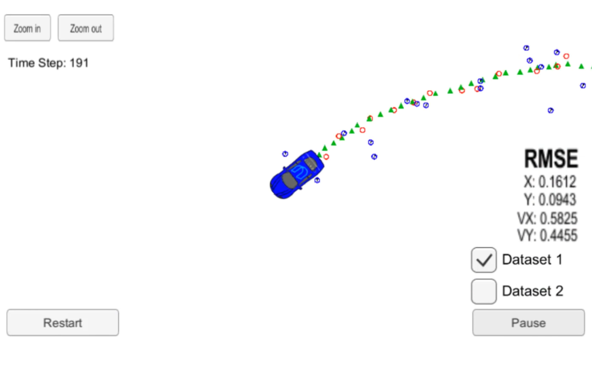

# Project: State Tracking and Sensor Fusion of Moving Object with Extended Kalman Filters

## Background
Here, we'd like our self-driving car to track the state of a moving object, such as a pedestrian or a bicycle. 

To do state tracking, many approaches can be used, but here we use Kalman filters and extended Kalman filters. 

Let's say the predicted state of the moving object is represented by a gaussian distribution with mean of vector $x\prime$, where $x\prime = [p_x\prime, p_y\prime, v_x\prime, v_y\prime]$.

With a LIDAR sensor, we can obtain a measurement (through some computations from a point cloud) represented by $z = [p_x, p_y]$. To map the predicted state vector $x\prime$ into measurement vector space, we can do $Hx\prime$, where  $
H = \begin{bmatrix}
1 & 0 & 0 & 0\\
0 & 1 & 0 & 0
\end{bmatrix}
 $
Since such transformation can be done with a matrix, the regular Kalman filter setting can be used. Note that this transformation is linear, which preserves the gaussian nature of the state.

<!-- LIDAR output point cloud (here we assume already computed object position) -->

Unfortunately, LIDAR is not enough to obtain our full desired state representation because it only output the position $p_x, p_y$. This is where a RADAR sensor, which uses doppler effect to measure radial velocity, can come in handy. 

The RADAR sensor measures $\rho, \phi, \dot{\rho}$ for radial distance, bearing angle, and radial velocity respectively. This means that to map the state vector space, which is in Cartesian coordinates, to this RADAR's measurement space which is in polar coordinates, a simple matrix transformation is not possible. Ideally, a nonlinear transformation function $h(x\prime)$ can be used, where 

$
h(x\prime) = \begin{bmatrix}
\rho \\
 \phi, \\
 \dot{\rho}
\end{bmatrix}
= \begin{bmatrix}
\sqrt{p\prime^2_x+p\prime^2_y} \\
\arctan(p\prime_y/p\prime_x)\\ 
 \frac{p\prime_xv\prime_x + p\prime_yv\prime_y}{\sqrt{p\prime^2_x+p\prime^2_y}}
\end{bmatrix}
$

However, directly using $h(x\prime)$, which is a nonlinear transformation, would result in an output where its distribution is not Gaussian. 

Thus, with extended Kalman filters (EKF), as shown in the right hand side of the above figure, $h(x\prime)$ is can be approximated as a linear function by using first-order Taylor expansion. The first-order form requires us to compute the Jacobian matrix $H_j$ which is the partial derivatives of the measurement vector elements with respect to the state vector elements.

Alternating between state prediction and state update step, the flow of fusing both sensors can be represented by the diagram below. 

## Application 

### Data
The data stream comes from a text file `data/obj_pose-laser-radar-synthetic-input.txt` which includes LIDAR and RADAR measurements.

For a row containing RADAR data, the columns are: `sensor_type, rho_measured, phi_measured, rhodot_measured, timestamp, x_groundtruth, y_groundtruth, vx_groundtruth, vy_groundtruth, yaw_groundtruth, yawrate_groundtruth`, whereas for LIDAR data, the columns are: `sensor_type, x_measured, y_measured, timestamp, x_groundtruth, y_groundtruth, vx_groundtruth, vy_groundtruth, yaw_groundtruth, yawrate_groundtruth`.

### Code
Some starter code, including the function definitions and simulation-related code (utilizing Udacity's simulator), was provided. My task was to write and populate the functions, especially those with `TODO` marks.

C++ code was written to incorporate both the kalman filter equations for LIDAR and the EKF for RADAR (in `src/FusionEKF.cpp`, specific example for Kalman filter in `src/kalman_filter.cpp`) leveraging the `Eigen` library. 

Since we're using first-order Taylor expansion for the EKF (excluding the Hessian and higher order terms), the Jacobian matrix $H_j$ is computed in `tools.cpp` under `CalculateJacobian`.

Finally, the flow, as shown in figure above, is constructed in `main.cpp` which, when executed, performs the state tracking task.

Further information for code execution can be found in `src/README.md` (provided by Udacity)

### Simulation

We estimate a bicycle's state around our vehicle. Using Udacity's simulator, the simulation is as shown below. The LIDAR measurements are the red circles, radar measurements are blue circles with an arrow pointing in the direction of the observed angle, and estimation markers are green triangles.

## References

Some starter code and image assets are provided by Udacity, the course provider.
