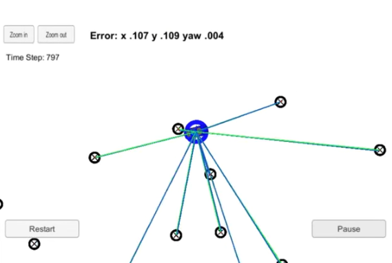

# Project: Localization with Particle Filters

## Background
Another type of Bayesian filtering is Particle Filtering, where it leverages Monte Carlo simulation instead of measurement functions or matrices to approximate the posterior probability distribution. Similar to the Kalman filter, it also goes through a continuous loop of prediction and subsequent update steps. 

The particle filter works roughly as follows:

1. Initialize prior beliefs by generating many particles/possible states of the target object (e.g. location and orientation) by sampling from a distribution (e.g. multimodal Gaussian) around an initial estimate (e.g. GPS measurement). 
2. Using a motion model, predict the next state of each particle and update the particles with these predicted values.
3. Each time a measurement of the object state is received, compute importance weight of each particle. The closer the particle state is to the measured state, the higher the importance. Update each particle's weight accordingly. 
4. Resample to obtain new set of particles, where the probability of resampling is the particle's normalized importance weight. The new set of particles would be the Bayesian posterior, which would then be the prior for the next step.

Mathematically, the algorithm for particle filtering can be represented as shown in the pseudocode below (prepared by Udacity team).

Also, I find that the analogy below, written by Sebastian Thrun in the lecture video, helps to tie the sampling of particles to computing posterior for recursive Bayesian filtering.

## Application

### Data
We utilize a dataset `data/map_data.txt` which is a set of sparsely located landmarks which the particle filter would use for measurement updates.

All other measurements and controls are provided by the Udacity simulator.

### Code

Some starter code, including the function definitions and simulation-related code (utilizing Udacity's simulator), was provided. My task was to write and populate the functions, especially those with `TODO` marks.

The individual functions for each step above are written in `particle_filter.cpp` and executed in a loop in `main.cpp`. 

Further information on code execution can be found in `src/README.md` (provided by Udacity)

### Simulation

## References
Some starter code and image assets are provided by Udacity, the course provider.