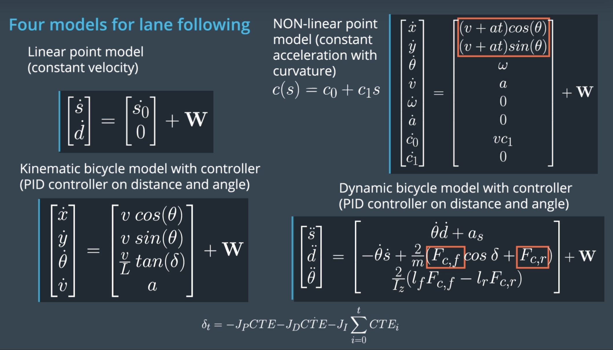
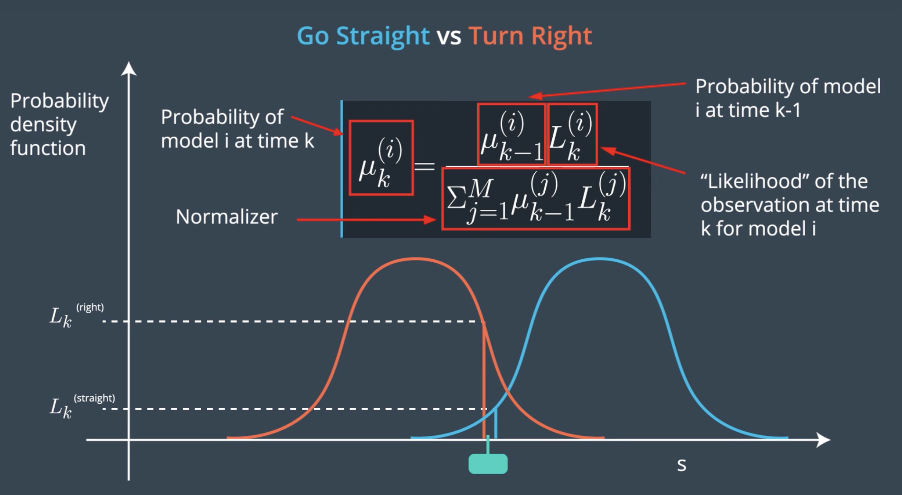
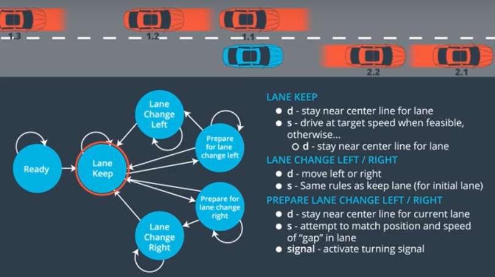

# Project: Path Planning on a Highway

## Background

### Objective
My goal is to build a path planner for a car such that it stays on a lane, avoids crashing into cars, and maintains acceleration that is not too jerky.

### Frenet Coordinates

We use Frenet coordinates to simplify navigating a known map/highway by representing the position of car(s) on the road with variables s and d instead of the traditional Cartesian coordinates, as shown in the figure below. The s represents how far in the road the car is, and d is how far the car is with respect to the center line, often used to see which lane the car is in.

<!--  -->

This simplifies computation as even if the road is curvy, when the car remains roughly on the same lane, its trajectory would be a straight line in Frenet space.

While the intermediate calculations, e.g. detecting whether 2 cars are on the same lane, would be simplified, the car's controls and sensors still tend to operate in Cartesian coordinates. Thus, this requires the map of the road to be known beforehand and represented in some way (e.g. a polynomial), such that the state of the cars/objects on the road can be converted from Frenet to Cartesian and vice versa. 

### Prediction

Assuming our car is given the states of other cars it sees e.g. via a sensor fusion module (refer to my sensor fusion project for more details), due to the lag between observation and sending out the controls to the car, it is crucial to be able to predict what happens next in order for the car to make a good decision. To do so, it can use data-driven and model-based approaches. 

#### Data-driven Approaches

Given there's enough data in the past to make predictions, we can use machine learning estimators to help the car predict detected vehicle's trajectories.

#### Model-based Approaches

Another approach is by explicitly defining models to predict trajectories/behavior, often using known dynamics of the systems (e.g. kinematic equations). We can define these as process models. 

If we have multiple process models for a car, we can use multimodal estimation to maintain a belief of which behavior a driver/object/car would likely choose, by defining a probability distribution for each model, as shown below. 

### Finite State Machines

A path planenr roughly resembles a finite state machine. An example for a self-driving car on a highway can be as shown in the figure below.

## Application

### Data 
(Description taken from Udacity manual)
#### Main car's localization Data (No Noise)

* ["x"] The car's x position in map coordinates
* ["y"] The car's y position in map coordinates
* ["s"] The car's s position in frenet coordinates
* ["d"] The car's d position in frenet coordinates
* ["yaw"] The car's yaw angle in the map
* ["speed"] The car's speed in MPH

#### Previous path data given to the Planner

//Note: Return the previous list but with processed points removed, can be a nice tool to show how far along
the path has processed since last time. 

* ["previous_path_x"] The previous list of x points previously given to the simulator
* ["previous_path_y"] The previous list of y points previously given to the simulator

#### Previous path's end s and d values 

* ["end_path_s"] The previous list's last point's frenet s value
* ["end_path_d"] The previous list's last point's frenet d value

#### Sensor Fusion Data, a list of all other car's attributes on the same side of the road. (No Noise)

* ["sensor_fusion"] A 2d vector of cars and then that car's * [car's unique ID, car's x position in map coordinates, car's y position in map coordinates, car's x velocity in m/s, car's y velocity in m/s, car's s position in frenet coordinates, car's d position in frenet coordinates. 

### Code

I leverage the `Eigen` library for defining and computing over vectors/matrices, and the `spline` library for smoothening paths.

First, the car checks if there's any other cars in its lane using Frenet coordinates. If it sees one too close in front, it would slow down to a reference speed, and if it sees one too close behind, it would accelerate accordingly. 

Next, to ensure the car follows the lane, we generate widely-spaced waypoints in Frenet coordinates (that maintains the car within the same d) then convert it to Cartesian coordinates, and additionally, smoothen the path using spline by interpolating between waypoints. 

Finally, the car could also make lane changes, made simple again with Frenet coordinates by creating waypoints with a new $d$ variable (e.g. if I'm in center lane where $d=0$, if I want to change to the left lane, I would generate waypoints with $d=-0.5$). 

Further information on code execution can be found in `src/README.md` (provided by Udacity)

### Simulation

I provide here an example of the car making a lane-change (I don't have access to the simulator anymore so using an image Udacity provided).

